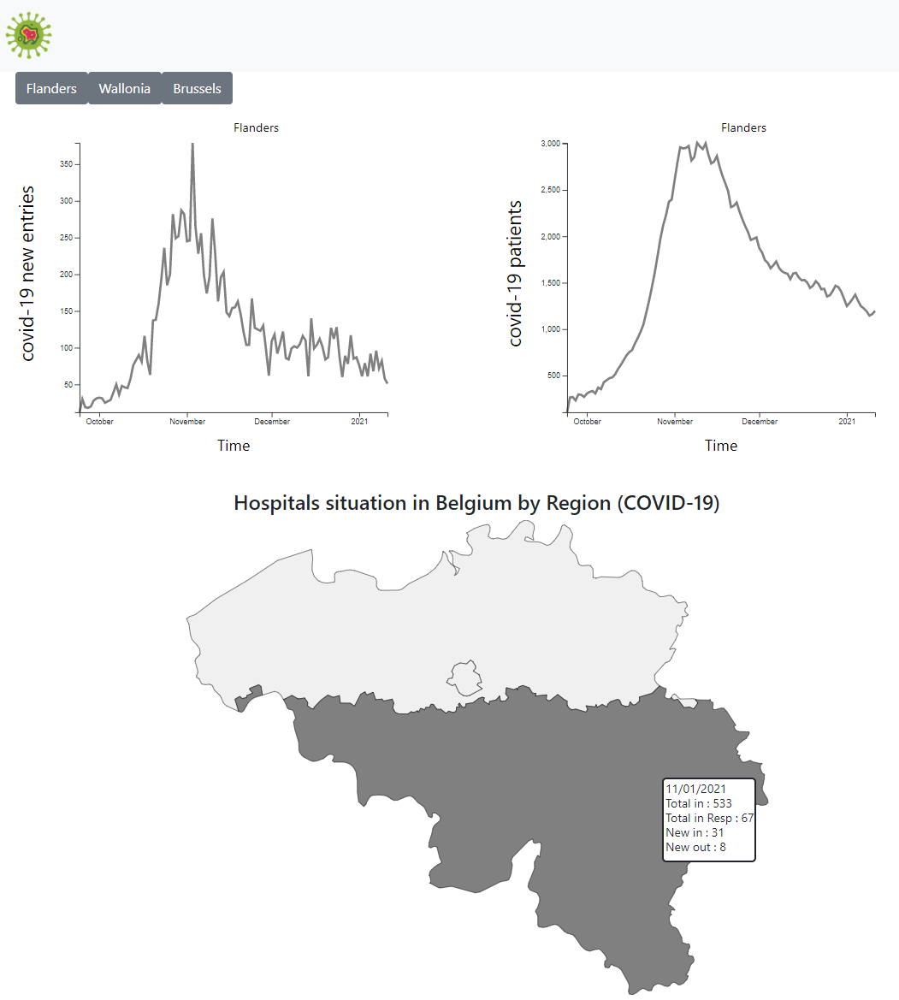

# DataViz Belgium's Hospitals situation Covid-19

DataViz with D3.js v5 LineCharts & MapChart that displays last updated data about Belgium's hospitals situation during COVID-19.



## Back-end Spring Boot

Consume the openData API restructure, filter and format the response, make the new data available on a HTTP Endpoint, put it in cache for better performance.

## Front-end React.js & D3.js

Call the back-end get a smarter data, avoiding heavy working and loading on the client's side

### LineChart

Built a LineChart class that is used 2 times to create a graph about the number of hospital's intakes in Belgium and an another one with the total number of patients for the last few months.

### Map

Used MapChart that represents Belgium and on mouse move or click on one region you get the situations of Hospitals in that region.

## Tech

[Spring] - Java-based framework

[D3.js] - JavaScript library for visualizing data with HTML, SVG, and CSS.

[openData] - openData pandemic belgium hospitalisations API

[NaturalEarthData] - World vector map data

[React.js] - JavaScript library for building user interfaces

[Spring]: <https://spring.io/>
[openData]: <https://data.opendatasoft.com/explore/dataset/covid-19-pandemic-belgium-hosp-province%40public/api/?sort=date>
[D3.js]: <https://d3js.org/>
[NaturalEarthData]: <https://www.naturalearthdata.com/downloads/10m-cultural-vectors/10m-admin-0-details/>
[React.js]: <https://reactjs.org/>

## How to run

In the project directory, you can run:

```console
./mvnw package
java -jar target/covid19-belgian-dashboard-1.0-SNAPSHOT.jar
```

<http://localhost:8080>